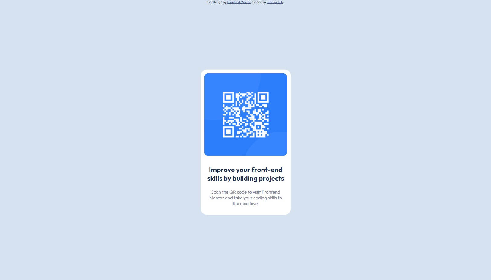

# Frontend Mentor - QR code component solution

This is a solution to the [QR code component challenge on Frontend Mentor](https://www.frontendmentor.io/challenges/qr-code-component-iux_sIO_H). Frontend Mentor challenges help you improve your coding skills by building realistic projects.

## Table of contents

- [Overview](#overview)
  - [The challenge](#the-challenge)
  - [Screenshot](#screenshot)
  - [Links](#links)
- [My process](#my-process)
  - [Built with](#built-with)
  - [What I learned](#what-i-learned)
- [Author](#author)
- [Acknowledgments](#acknowledgments)

## Overview

This is a challenge from Frontend Mentor to build a qr-code card component which responsive in both desktop and mobile view. I'm using pure HTML and CSS to solve this challenge.

## The challenge

Your challenge is to build out this QR code component and get it looking as close to the design as possible.

### Screenshot




### Links

- Solution URL: [https://www.frontendmentor.io/solutions/responsive-qr-code-component-JtuGmx9tUI](https://www.frontendmentor.io/solutions/responsive-qr-code-component-JtuGmx9tUI)
- Live Site URL: [https://joshuakme.github.io/fm-qr-code-component-main/](https://joshuakme.github.io/fm-qr-code-component-main/)

## My process

I took around 30 minutes to complete this task since this task is easier in terms of responsive.

### Built with

- Semantic HTML5 markup
- CSS custom properties
- Flexbox

### What I learned

I've learned a easy approach to center an absolute positioned div. The horizontal centering can be done by setting left and right to 0, and set margin-left and margin-right to auto. To center div vertically, we can simply set top: 50%, and translateY: -50%

To see how you can add code snippets, see below:

```html
<body>
  <section class="qr-code-component"></section>
</body>
```

```css
.qr-code-component {
  position: absolute;
  top: 50%;
  transform: translate(0, -50%);
  left: 0;
  right: 0;
  margin: 0.5rem auto;
}
```

## Author

- Website - [Joshua Koh](https://github.com/Joshuakme)
- Frontend Mentor - [@Joshuakme](https://www.frontendmentor.io/profile/Joshuakme)

## Acknowledgments

- This is one of the solution I used in this challenge to center div horizontally. [YouTube HTML-TUTS.com](https://www.youtube.com/watch?v=HWtiX_N2IYg)
